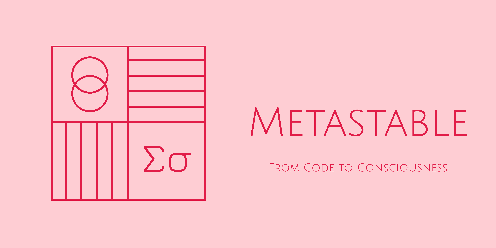

<div align="center">


<br/><br/>

[Website](https://metastable.art) • [Documentation](https://docs.metastable.art) • [Getting Started](#getting-started)

[](LICENSE)

</div>

## 🌊 What is Metastable?

Metastable is a cutting-edge AI Agent system designed to revolutionize how we build and interact with intelligent agents. It provides a comprehensive, production-ready framework for creating sophisticated AI applications with truly long-term memory and a powerful modular architecture.

Key benefits:

- 🚀 **Rapid Development**: Build production-ready AI agents in minutes, not months.
- 🧱 **Modular by Design**: A flexible system with powerful, interchangeable modules for memory, roleplay, and more.
- 🧠 **Advanced Memory**: Go beyond context windows with a sophisticated, graph-based long-term memory engine.
- 🔒 **Enterprise Grade**: Built for reliability, scalability, and security.

## ✨ Core Features

### 🧱 Modular Agent Architecture
Metastable is built on a flexible core runtime that allows developers to easily plug in different modules to create highly customized agents. Swap out memory systems, add new character capabilities, or integrate custom tools with ease. This design promotes code reuse and rapid experimentation.

### 🧠 Sophisticated Memory Engine (Mem0)
Our advanced memory module, `Mem0`, gives agents the ability to remember, reason, and learn from past interactions. It moves beyond simple context windows to provide true long-term memory.

- **Graph-Based Knowledge**: Automatically structures conversations into a knowledge graph of entities and relationships.
- **Hybrid Search**: Combines semantic vector search with structured graph queries for unparalleled context retrieval and reasoning.
- **LLM-Powered Intelligence**: Uses LLMs to dynamically analyze interactions and update the memory graph.
- **Scalable Persistence**: Built on Postgres and `pgvector` to ensure memory scales with your application.

### 🎭 Dynamic Roleplay System
A foundational module that enables rich, interactive experiences:
- **Dynamic Personality & Character Creation**: Build agents with unique, consistent personalities.
- **Context-Aware Conversations**: Maintain state and context over extended interactions.
- **Behavioral Consistency**: Ensure agents act in character at all times.

### 🛠️ Extensible Tooling System
Extend your agents' capabilities with a simple and powerful tooling system:
- A rich library of built-in tools.
- A clear interface for creating your own custom tools.
- Seamless integration with external APIs and services.

## 🚀 Getting Started

1. **Clone the repository:**
   ```bash
   git clone https://github.com/metastable-lab/metastable.git
   cd metastable
   ```
2. **Set up your environment:**
   Copy the `.env.example` file to `.env` and fill in the required API keys and endpoints.
3. **Run the API service:**
   ```bash
   just api
   ```
   (See `justfile` for more commands and services to run)

## 💡 Use Cases

- **AI-Powered Research Assistants**: Agents that can synthesize information from vast datasets and remember key facts across weeks of interaction.
- **Personalized Tutors**: Learning companions that adapt to a user's progress and knowledge over time.
- **Sophisticated NPCs for Gaming**: Create game characters with persistent memory and dynamic, evolving personalities.
- **Complex Task Automation**: Build agents that can perform multi-step tasks, remembering preferences and context from previous requests.
- **Intelligent Customer Support**: Agents that remember a customer's entire history, providing personalized and efficient support.

## 📚 Documentation

Visit our comprehensive documentation at [docs.metastable.art](https://docs.metastable.art) for:
- Detailed API Reference
- Tutorial Guides
- Best Practices
- Example Projects

## 🤝 Contributing

We welcome contributions from the community! Whether it's:
- 🐛 Bug fixes
- ✨ New features
- 📚 Documentation improvements
- 💡 Feature suggestions

We are actively looking for contributors. Please check out the [Issue Tracker](https://github.com/metastable/metastable/issues) for good first issues.

## 🆘 Support

- 📝 [Issue Tracker](https://github.com/metastable/metastable/issues)

## 📄 License

Metastable is licensed under the Apache License 2.0 - see the [LICENSE](LICENSE) file for details.

---

<div align="center">
Built with 💧 by the Metastable Team
</div>
